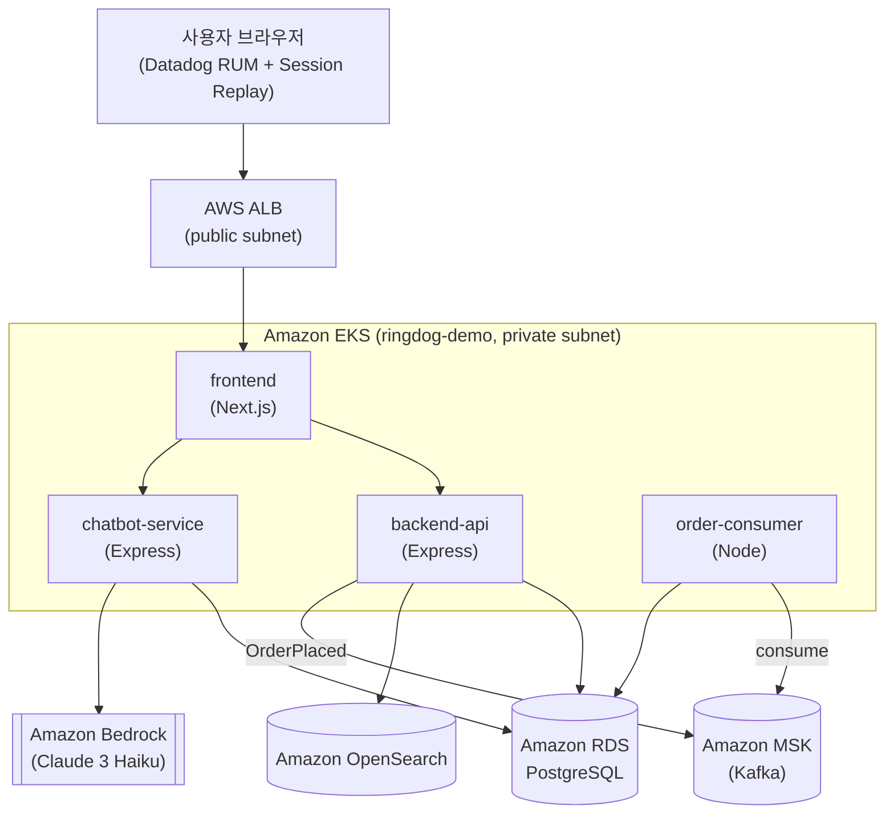
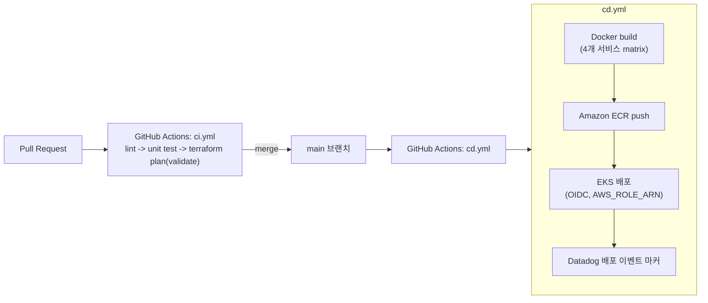

# RingDog 아키텍처

RingDog은 Datadog 풀스택 관측성(RUM/APM/Logs/CI-CD Visibility/DSM/LLM Observability/ASM/
Infrastructure Monitoring)을 하나의 시나리오로 시연하기 위한 데모용 키링 이커머스 앱이다.
사용자는 상품을 탐색·검색·구매하고 사이트 내 챗봇과 대화하며, 그 과정에서 발생하는 모든
트래픽이 브라우저부터 인프라까지 Datadog으로 수집되어 하나의 트레이스로 이어진다.

## 1. 시스템 아키텍처

- **frontend**: Next.js, ALB Ingress 뒤에서 서비스. 브라우저에 Datadog RUM SDK를 심어
  결제 버튼 클릭, 챗봇 위젯 사용 등 사용자 행동과 프론트엔드 에러를 수집한다.
- **backend-api**: 인증/상품/검색/장바구니/주문 API. RDS(PostgreSQL)에 쓰고, OpenSearch로
  검색을 위임하며, 주문 완료 시 MSK에 `OrderPlaced` 이벤트를 발행한다.
- **chatbot-service**: 챗봇 질의를 받아 RDS에서 상품/주문 컨텍스트를 조회한 뒤 Amazon
  Bedrock을 호출해 응답을 생성한다.
- **order-consumer**: MSK의 `OrderPlaced`를 소비해 주문 상태를 비동기로 갱신한다.

## 2. CI/CD 플로우

- 인증은 전 구간 GitHub OIDC + `AWS_ROLE_ARN`(IAM 역할 `ringdog-github-actions-deploy`)만
  사용하며 장기 Access Key는 쓰지 않는다.
- 배포 직후 Datadog Events API에 배포 마커를 남겨 APM 에러율 급등과 배포 시점의 상관관계를
  확인할 수 있게 한다(NFR-OBS-003).

## 3. Datadog 제품군 매핑

| Datadog 제품 | 주요 발생 지점 | 데모 시나리오 |
|---|---|---|
| RUM | frontend (`@datadog/browser-rum`) | 결제 버튼 클릭 지연 Session Replay, 챗봇 위젯 사용 행동, 의도적 프론트 에러 확인 |
| APM | backend-api / chatbot-service / order-consumer (dd-trace) | 주문 API DB lock 대기, OpenSearch 쿼리 지연, 챗봇->Bedrock 호출 체인 추적 |
| Logs | 전 서비스 Datadog Agent 로그 수집(JSON) | 주문 실패·챗봇 오류 로그를 trace_id로 APM과 연계 검색 |
| CI/CD Visibility | GitHub Actions(`ci.yml`/`cd.yml`) + DD_CIVISIBILITY_ENABLED | PR 빌드/테스트/배포 파이프라인 타임라인, 실패 스텝 원인 분석, 배포-에러율 상관관계 |
| DSM | backend-api(producer)/order-consumer(consumer), MSK | OrderPlaced 이벤트 생산/소비 지연 및 파티션 적체 토폴로지 시각화 |
| LLM Observability | chatbot-service -> Amazon Bedrock | 프롬프트/응답/토큰 사용량/지연 대시보드, 환각·고지연 응답 식별 |
| ASM | backend-api(Express) + ALB | 로그인/검색/챗봇 입력에 SQLi 문자열 주입 시 탐지·차단 이벤트 확인 |
| Infrastructure Monitoring | Datadog Agent DaemonSet(EKS) + AWS 통합 | EKS 노드 CPU/메모리, RDS 연결 수, MSK 브로커 메트릭 대시보드 |

## 4. 현재 구현 상태 (M1: 인프라/IaC/CI-CD 기반)

이번 스캐폴딩 단계에서 만든 것:

- `.github/workflows/ci.yml`: PR 시 lint / unit test(Datadog CI Visibility 연동) /
  `infra/terraform/envs/demo`에 대한 `terraform fmt`/`validate`.
- `.github/workflows/cd.yml`: main 머지 시 4개 서비스 Docker 빌드·ECR 푸시 -> EKS 배포
  플레이스홀더 -> Datadog 배포 마커 -> 스모크 테스트. OIDC 기반 AWS 인증만 사용.
- `deploy/helm/datadog-agent/values.yaml`: Datadog Agent Helm 차트 values(APM/Logs/
  DSM/Infra/ASM 원격설정/Cluster Agent 어드미션 컨트롤러 활성화).
- 본 문서(`docs/architecture.md`).

다음 마일스톤으로 미룬 것:

- **M2**: `apps/*` 각 서비스의 실제 비즈니스 로직, Dockerfile, per-app Helm 차트
  (`deploy/helm/charts/<service>`) — 현재 `cd.yml`의 배포 스텝은 차트가 없어
  `kubectl set image` 형태의 플레이스홀더로 남겨둠. `infra/terraform/envs/demo`의
  실제 VPC/EKS/RDS/MSK/OpenSearch 모듈 조합.
- **M3**: chatbot-service의 Bedrock 연동 및 LLM Observability 대시보드.
- **M4**: RUM/APM/Logs/DSM/ASM/Infra 대시보드·모니터 구성, ALB 프로비저닝 후
  `cd.yml`의 `smoke_test` 잡에 실제 `ALB_HOSTNAME` 값 연결, 장애/공격/배포 실패
  재현 시나리오 문서화.
