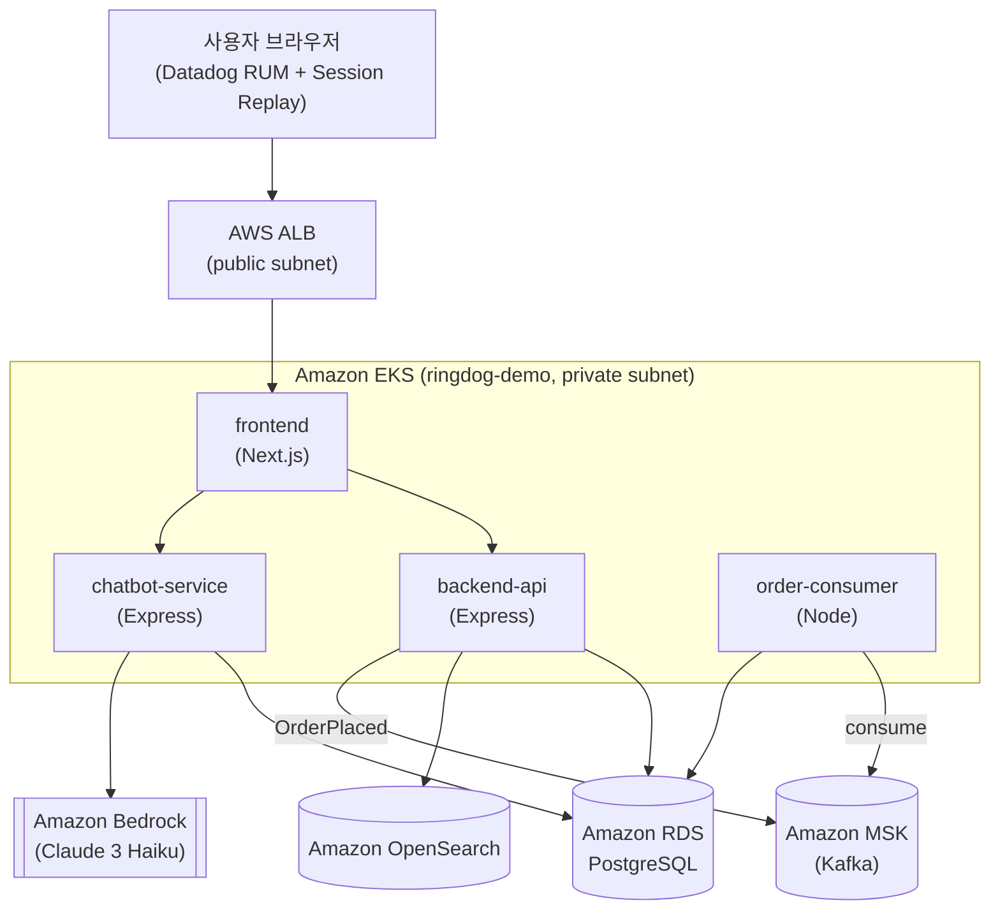
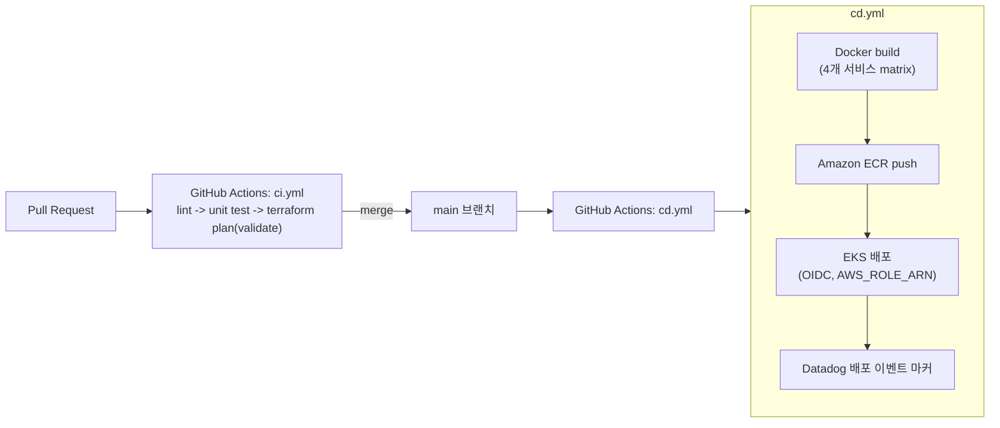

# RingDog 아키텍처

RingDog은 Datadog 풀스택 관측성(RUM/APM/Logs/CI-CD Visibility/DSM/LLM Observability/ASM/
Infrastructure Monitoring)을 하나의 시나리오로 시연하기 위한 데모용 키링 이커머스 앱이다.
사용자는 상품을 탐색·검색·구매하고 사이트 내 챗봇과 대화하며, 그 과정에서 발생하는 모든
트래픽이 브라우저부터 인프라까지 Datadog으로 수집되어 하나의 트레이스로 이어진다.

## 1. 시스템 아키텍처

- **frontend**: Next.js, ALB Ingress 뒤에서 서비스. 브라우저에 Datadog RUM SDK를 심어
  결제 버튼 클릭, 챗봇 위젯 사용 등 사용자 행동과 프론트엔드 에러를 수집한다.
- **backend-api**: 인증/상품/검색/장바구니/주문 API. RDS(PostgreSQL)에 쓰고, OpenSearch로
  검색을 위임하며, 주문 완료 시 MSK에 `OrderPlaced` 이벤트를 발행한다.
- **chatbot-service**: 챗봇 질의를 받아 RDS에서 상품/주문 컨텍스트를 조회한 뒤 Amazon
  Bedrock을 호출해 응답을 생성한다.
- **order-consumer**: MSK의 `OrderPlaced`를 소비해 주문 상태를 비동기로 갱신한다.

## 2. CI/CD 플로우

- 인증은 전 구간 GitHub OIDC + `AWS_ROLE_ARN`(IAM 역할 `ringdog-github-actions-deploy`)만
  사용하며 장기 Access Key는 쓰지 않는다.
- 배포 직후 Datadog Events API에 배포 마커를 남겨 APM 에러율 급등과 배포 시점의 상관관계를
  확인할 수 있게 한다(NFR-OBS-003).

## 3. Datadog 제품군 매핑

| Datadog 제품 | 주요 발생 지점 | 데모 시나리오 |
|---|---|---|
| RUM | frontend (`@datadog/browser-rum`) | 결제 버튼 클릭 지연 Session Replay, 챗봇 위젯 사용 행동, 의도적 프론트 에러 확인 |
| APM | backend-api / chatbot-service / order-consumer (dd-trace) | 주문 API DB lock 대기, OpenSearch 쿼리 지연, 챗봇->Bedrock 호출 체인 추적 |
| Logs | 전 서비스 Datadog Agent 로그 수집(JSON) | 주문 실패·챗봇 오류 로그를 trace_id로 APM과 연계 검색 |
| CI/CD Visibility | GitHub Actions(`ci.yml`/`cd.yml`) + DD_CIVISIBILITY_ENABLED | PR 빌드/테스트/배포 파이프라인 타임라인, 실패 스텝 원인 분석, 배포-에러율 상관관계 |
| DSM | backend-api(producer)/order-consumer(consumer), MSK | OrderPlaced 이벤트 생산/소비 지연 및 파티션 적체 토폴로지 시각화 |
| LLM Observability | chatbot-service -> Amazon Bedrock | 프롬프트/응답/토큰 사용량/지연 대시보드, 환각·고지연 응답 식별 |
| ASM | backend-api(Express) + ALB | 로그인/검색/챗봇 입력에 SQLi 문자열 주입 시 탐지·차단 이벤트 확인 |
| Infrastructure Monitoring | Datadog Agent DaemonSet(EKS) + AWS 통합 | EKS 노드 CPU/메모리, RDS 연결 수, MSK 브로커 메트릭 대시보드 |

## 4. 현재 구현 상태 (2026-07-10 기준)

`infra/terraform/envs/demo`는 비용 문제로 데모 세션마다 destroy/apply를 반복하는
운영 방식을 쓴다(`docs/local-setup-progress.md` 참고) — 아래는 코드 기준 구현 상태다.

**M1 (인프라/IaC/CI-CD 기반) — 완료.**
- Terraform: VPC/EKS/RDS/MSK/OpenSearch/ECR/IAM(IRSA)/ALB 컨트롤러까지 전부
  `infra/terraform/envs/demo`에서 apply 가능. GitHub Actions는 OIDC + `AWS_ROLE_ARN`
  단일 시크릿만으로 인증하며, 나머지 배포 설정(DB/JWT 시크릿, MSK 브로커, OpenSearch
  엔드포인트, IRSA 롤 ARN)은 `cd.yml`이 매 배포마다 AWS에서 고정 리소스 이름으로 직접
  조회한다.
- `.github/workflows/ci.yml`: PR 시 lint / unit test(Datadog CI Visibility 연동) /
  `terraform fmt`+`validate`.
- `.github/workflows/cd.yml`: 4개 서비스 Docker 빌드 → ECR 푸시 → Datadog Agent 설치 →
  DB 마이그레이션/시드 → ALB 컨트롤러 설치 → RingDog Helm 배포(2단계: ALB 생성 전/후) →
  Datadog 배포 이벤트 마커 → 스모크 테스트. 실제 ALB 배포까지 그린 확인됨.
- `deploy/helm/datadog-agent/values.yaml`: Datadog Agent가 실제 API 키로 클러스터에
  떠서 동작 중(APM/Logs/DSM/Infra/Cluster Agent 어드미션 컨트롤러 활성화 상태).

**M2 (코어 이커머스 기능) — 완료.**
- `apps/backend-api`: 인증(JWT)/상품/검색(OpenSearch, DB fallback)/장바구니/주문
  (체크아웃 + 목록 + 상세 + 취소) API, `deploy/helm/charts/ringdog`의 개별 Deployment로
  배포.
- `apps/frontend` (Next.js App Router): 홈(상품 목록), 상품 상세(`/products/[id]`),
  로그인/회원가입, 장바구니/체크아웃, 주문 내역/취소(`/orders`).
- `apps/order-consumer`: MSK `OrderPlaced` 소비 → 주문 상태 `PENDING`→`PAID` 비동기
  전환.

**M3 (챗봇 + LLM Observability) — 기능은 완료, 응답 품질은 추가 점검 필요.**
- `apps/chatbot-service`가 Amazon Bedrock을 호출해 응답 생성, 세션/메시지 이력을
  RDS에 저장(`GET /api/chat/sessions/:session_id`로 조회 가능).
- 프론트 챗봇 위젯이 사용자/봇 메시지를 카카오톡 스타일 말풍선으로 누적 표시.
- 알려진 이슈: 챗봇이 시딩된 실제 상품 데이터 대신 일반적인 답변을 하는 경향이 관찰됨
  — `contextBuilder.ts`/프롬프트 구성 추가 점검 필요(`docs/local-setup-progress.md`
  2026-07-10 항목 참고).

**M4 (관측성·보안·CI/CD 고도화) — 부분 완료.**
- 완료: RUM(브라우저 SDK 심음), APM(dd-trace 전 서비스), Logs(Agent 수집), DSM(Kafka
  producer/consumer 계측), Infrastructure Monitoring(Agent DaemonSet), CI/CD
  Visibility(`DD_CIVISIBILITY_ENABLED`), 배포 이벤트 마커.
- 미완료: **ASM**은 아직 앱 레벨에서 비활성 상태 — `DD_APPSEC_ENABLED`가 Datadog Agent
  values의 주석에만 언급되어 있고 `backend-api`/`chatbot-service` Deployment의 실제
  env로는 배선되지 않았음. RUM/APM/LLM Observability 등 실제 Datadog 대시보드에 데이터가
  들어오는지는 Datadog 웹 UI 로그인 확인이 아직 안 된 상태. 장애/공격/배포 실패 재현
  시나리오 문서화도 미착수.

## 5. 프론트엔드 ↔ 백엔드 통신: 상대경로(same-origin) 사용 이유

`apps/frontend`는 `backend-api`/`chatbot-service`를 절대 URL이 아니라 **상대경로**로
호출한다(`apiClient.ts`, `ChatWidget.tsx`). Next.js의 `NEXT_PUBLIC_*` 환경변수는
`next build`(Docker 빌드 시점)에 클라이언트 번들에 인라인되는데, 이 시점엔 ALB
호스트네임이 아직 존재하지 않아 값을 정확히 넣을 방법이 없다 — 배포 후 Helm/런타임
환경변수로 바꿔도 이미 컴파일된 클라이언트 JS에는 반영되지 않는다. ALB Ingress가
`/`(frontend)·`/api`(backend-api)·`/api/chat`(chatbot-service)를 전부 같은 호스트로
라우팅하므로, 상대경로 fetch는 배포 환경에서 자연스럽게 same-origin으로 동작한다.
로컬 dev는 프론트(3000)/백엔드(4000/4001)가 서로 다른 포트라 `.env`의
`NEXT_PUBLIC_API_BASE_URL=http://localhost:4000` 절대경로 값을 그대로 쓴다.
